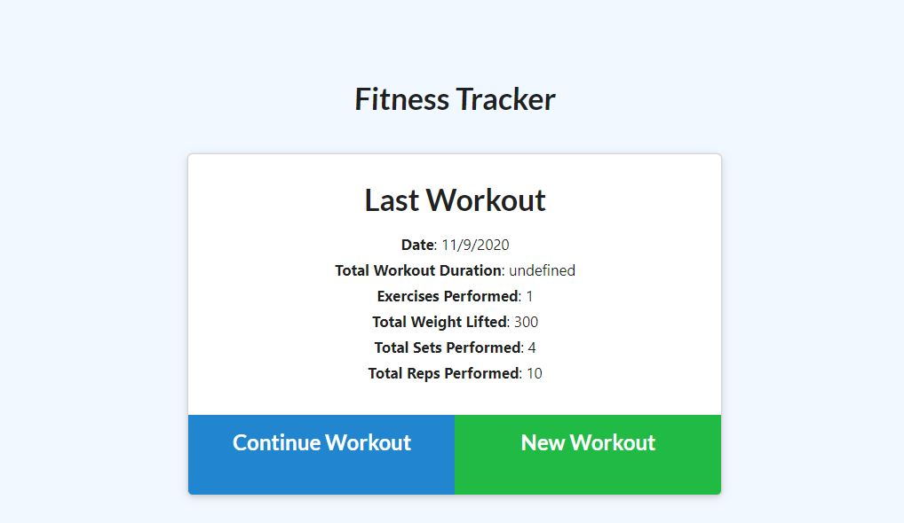
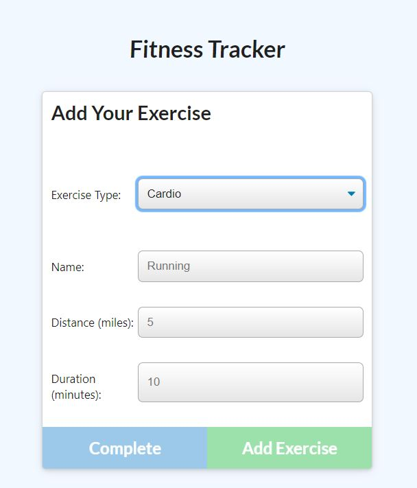
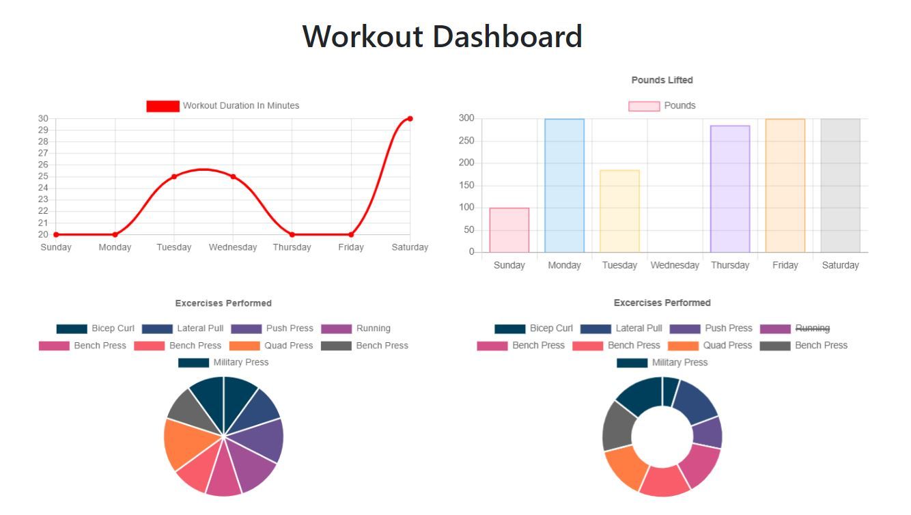

# Fitness-Tracker
A simple app for tracking your workouts.  Utilizes a mongo database with front end and back end javascript.

## Table of Content
  * [Link](#link)

  * [Installation](#installation)

  * [Usage](#usage)
  
  * [License](#license)

  * [Questions](#questions)

## Link
This is the link to the deployed application: <https://fierce-journey-14663.herokuapp.com/>

## Usage
The Fitness Tracker screen displays the information for your last workout

Click the New Workout button to add a new workout or click the Continue Workout button to continue a workout. Once you've entered in all of your exercise information, click on Add Exercise to add the exercise, or click on Complete to mark the exercise as complete.

Click on the Dashboard link at the top of the page to open teh Workout Dahsboard.  See all of your workout stats here.

## License 
<https://unlicense.org>

## Questions
Feel free to reach out with any questions.
